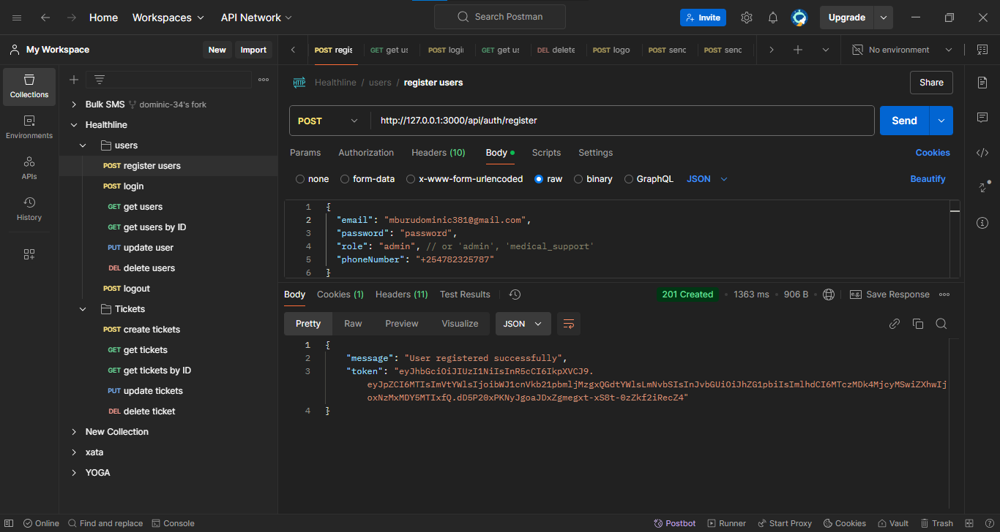
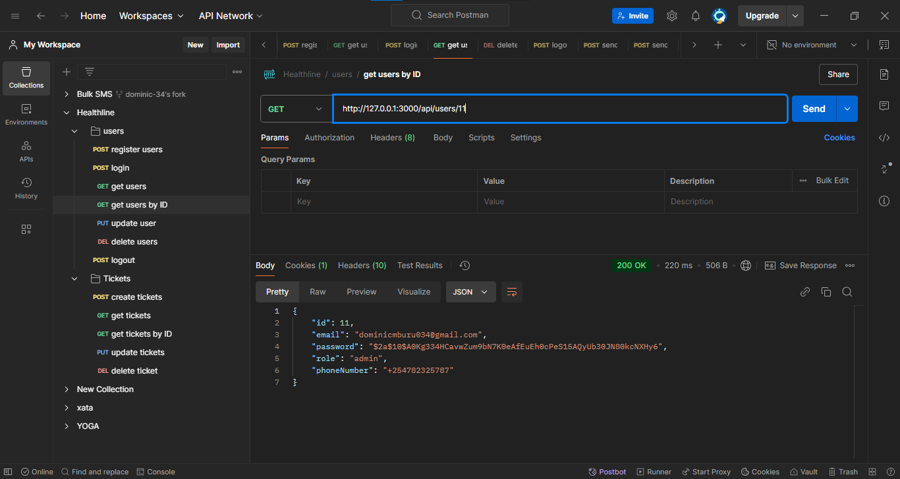

# HealthLine Ticketing System

Welcome to the **HealthLine Ticketing System**! This comprehensive backend application is designed to manage user authentication, role-based authorization, and a robust ticketing system for handling customer inquiries and support requests. It leverages modern technologies to ensure secure and efficient operations, providing seamless communication through SMS and Email notifications.

## Project Overview

The **HealthLine Ticketing System** is a backend application built with **Node.js**, **Express**, and **TypeScript**. It utilizes **TypeORM** for database interactions with **PostgreSQL** and implements **JWT-based authentication** along with **role-based authorization**. The system allows users to create and manage support tickets, ensuring effective communication and issue resolution through automated SMS and Email notifications.

## Features

- **User Authentication**: Secure registration, login, and logout functionalities using JWT.
- **Role-Based Authorization**: Access control based on user roles (`admin`, `medical_support`, `patient`).
- **Ticket Management**: Create, retrieve, update, and delete support tickets.
- **Notifications**: Automated SMS and Email notifications for ticket creation and updates.
- **Incoming SMS Handling**: Create tickets directly from incoming SMS messages.
- **Validation and Error Handling**: Robust input validation and comprehensive error responses.
- **Logging**: Detailed logging for monitoring and debugging purposes.
- **Security Measures**: Rate limiting and secure handling of sensitive data.


## Prerequisites

Before setting up the project, ensure you have the following installed on your system:

- **Node.js** (v14 or later)
- **pnpm** (Package manager)
- **PostgreSQL** (Database)
- **TypeScript**
- **Express**
- **TypeORM**
- **Africa's Talking Account** (for SMS services)
- **Email Service Account** (Nodemailer)

## Setup

### Environment Variables

Create a `.env` file at the root of the project with the following variables:

```plaintext
# Server Configuration
PORT=5000
CORS_ORIGIN=http://your-frontend-domain.com

# JWT Configuration
JWT_SECRET=your_jwt_secret_key

# Database Configuration
DB_HOST=localhost
DB_PORT=5432
DB_USERNAME=your_db_username
DB_PASSWORD=your_db_password
DB_DATABASE=healthline_db

# Africa's Talking SMS Configuration
AFRICASTALKING_API_KEY=your_africastalking_api_key
AFRICASTALKING_USERNAME=your_africastalking_username

# Email Service Configuration
EMAIL_SERVICE=Gmail
EMAIL_USER=your_email@example.com
EMAIL_PASS=your_email_password
```

## Installation

Install project dependencies
```
pnpm install
```

Run the application
```
pnpm run dev
```

## Authentication Endpoints

### Register User

- **Route: `/api/auth/register`**
- **Method: `POST`**
- **Request Body**
```
{
  "email": "user@example.com",
  "password": "password123",
  "role": "role",
  "phoneNumber": "+254000000000"
}
```
- **Response: Returns a JWT token in an HTTP-only cookie and a success message**

### Login User

- **Route:** `/api/auth/login`
- **Method:** `POST`
- **Description:** Authenticates a user and issues a JWT token.

#### Request Body:

```json
{
  "email": "user@example.com",
  "password": "password123"
}
```

### Logout User

- **Route**: `/api/auth/logout`
- **Method**: `POST`
- **Response**: Clears the JWT token from cookies and returns a success message.

### User Management Endpoints

#### Get All Users

- **Route:** `/api/users`
- **Method:** `GET`
- **Description:** Retrieves a list of all users.
- **Response:**
    - **Status:** `200 OK`
    - **Body:**

        ```json
        [
          {
            "id": 1,
            "email": "user1@example.com",
            "role": "patient",
            "phoneNumber": "+254712345678"
          },
          {
            "id": 2,
            "email": "user2@example.com",
            "role": "medical_support",
            "phoneNumber": "+254798765432"
          }
          // More users...
        ]
        ```

#### Get User by ID

- **Route:** `/api/users/:id`
- **Method:** `GET`
- **Description:** Retrieves a single user by their ID.
- **Response:**
    - **Status:** `200 OK`
    - **Body:**

        ```json
        {
          "id": 1,
          "email": "user@example.com",
          "role": "patient",
          "phoneNumber": "+254712345678"
        }
        ```

    - **Error Response (User Not Found):**

        ```json
        {
          "message": "User not found."
        }
        ```

#### Update User

- **Route:** `/api/users/:id`
- **Method:** `PUT`
- **Description:** Updates user information such as email, password, role, and phone number.
- **Request Body:**

    ```json
    {
      "email": "newemail@example.com",
      "password": "newpassword123",
      "role": "admin",
      "phoneNumber": "+254712345678"
    }
    ```

- **Response:**
    - **Status:** `200 OK`
    - **Body:**

        ```json
        {
          "message": "User updated successfully.",
          "user": {
            "id": 1,
            "email": "newemail@example.com",
            "role": "admin",
            "phoneNumber": "+254712345678"
          }
        }
        ```

    - **Error Responses:**
        - **Validation Errors:**

            ```json
            {
              "errors": [
                {
                  "msg": "Invalid email format.",
                  "param": "email",
                  "location": "body"
                },
                {
                  "msg": "Password must be at least 6 characters.",
                  "param": "password",
                  "location": "body"
                }
              ]
            }
            ```

        - **Email Already in Use:**

            ```json
            {
              "message": "Email is already in use by another user."
            }
            ```

        - **User Not Found:**

            ```json
            {
              "message": "User not found."
            }
            ```

#### Delete User

- **Route:** `/api/users/:id`
- **Method:** `DELETE`
- **Description:** Deletes a user by their ID.
- **Response:**
    - **Status:** `200 OK`
    - **Body:**

        ```json
        {
          "message": "User deleted successfully"
        }
        ```

    - **Error Response (User Not Found):**

        ```json
        {
          "message": "User not found."
        }
        ```

---

### Ticket Management Endpoints

#### Create Ticket

- **Route:** `/api/tickets`
- **Method:** `POST`
- **Description:** Allows an authenticated user to create a new support ticket.
- **Headers:**
    - `Authorization: Bearer <jwt_token>`
- **Request Body:**

    ```json
    {
      "subject": "Unable to access account",
      "description": "I have been trying to log into my account since yesterday, but it keeps saying my password is incorrect."
    }
    ```

- **Response:**
    - **Status:** `201 Created`
    - **Body:**

        ```json
        {
          "message": "Ticket created successfully",
          "ticket": {
            "id": 123,
            "subject": "Unable to access account",
            "description": "I have been trying to log into my account since yesterday, but it keeps saying my password is incorrect.",
            "patientPhoneNumber": "+254712345678",
            "patientEmail": "user@example.com",
            "status": "open",
            "emailSent": true,
            "smsSent": true,
            "emailSentAt": "2024-04-27T12:34:56.789Z",
            "smsSentAt": "2024-04-27T12:34:56.789Z",
            "assignedTo": null
          },
          "notifications": {
            "emailSent": true,
            "smsSent": true,
            "emailSentAt": "2024-04-27T12:34:56.789Z",
            "smsSentAt": "2024-04-27T12:34:56.789Z"
          }
        }
        ```

#### Get All Tickets

- **Route:** `/api/tickets`
- **Method:** `GET`
- **Description:** Retrieves a list of all tickets. Accessible by users with `admin` or `medical_support` roles.
- **Headers:**
    - `Authorization: Bearer <jwt_token>`
- **Response:**
    - **Status:** `200 OK`
    - **Body:**

        ```json
        [
          {
            "id": 123,
            "subject": "Unable to access account",
            "description": "I have been trying to log into my account since yesterday, but it keeps saying my password is incorrect.",
            "patientPhoneNumber": "+254712345678",
            "patientEmail": "user@example.com",
            "status": "open",
            "emailSent": true,
            "smsSent": true,
            "emailSentAt": "2024-04-27T12:34:56.789Z",
            "smsSentAt": "2024-04-27T12:34:56.789Z",
            "assignedTo": {
              "id": 2,
              "email": "support@example.com",
              "role": "medical_support",
              "phoneNumber": "+254798765432"
            }
          }
          // More tickets...
        ]
        ```

#### Get Ticket by ID

- **Route:** `/api/tickets/:id`
- **Method:** `GET`
- **Description:** Retrieves a specific ticket by its ID. Accessible by users with `admin` or `medical_support` roles, or the `patient` who created the ticket.
- **Headers:**
    - `Authorization: Bearer <jwt_token>`
- **Response:**
    - **Status:** `200 OK`
    - **Body:**

        ```json
        {
          "id": 123,
          "subject": "Unable to access account",
          "description": "I have been trying to log into my account since yesterday, but it keeps saying my password is incorrect.",
          "patientPhoneNumber": "+254712345678",
          "patientEmail": "user@example.com",
          "status": "open",
          "emailSent": true,
          "smsSent": true,
          "emailSentAt": "2024-04-27T12:34:56.789Z",
          "smsSentAt": "2024-04-27T12:34:56.789Z",
          "assignedTo": {
            "id": 2,
            "email": "support@example.com",
            "role": "medical_support",
            "phoneNumber": "+254798765432"
          }
        }
        ```

    - **Error Response (Ticket Not Found):**

        ```json
        {
          "message": "Ticket not found."
        }
        ```

#### Update Ticket

- **Route:** `/api/tickets/:id`
- **Method:** `PUT`
- **Description:** Updates a ticket's status or assigns it to a support user. Accessible by users with `admin` or `medical_support` roles.
- **Headers:**
    - `Authorization: Bearer <jwt_token>`
- **Request Body:**

    ```json
    {
      "status": "resolved", // Optional: 'open', 'in_progress', 'resolved', 'closed'
      "assignedToId": 2     // Optional: ID of the support user
    }
    ```

- **Response:**
    - **Status:** `200 OK`
    - **Body:**

        ```json
        {
          "message": "Ticket updated successfully",
          "ticket": {
            "id": 123,
            "subject": "Unable to access account",
            "description": "I have been trying to log into my account since yesterday, but it keeps saying my password is incorrect.",
            "patientPhoneNumber": "+254712345678",
            "patientEmail": "user@example.com",
            "status": "resolved",
            "emailSent": true,
            "smsSent": true,
            "emailSentAt": "2024-04-27T12:34:56.789Z",
            "smsSentAt": "2024-04-27T12:34:56.789Z",
            "assignedTo": {
              "id": 2,
              "email": "support@example.com",
              "role": "medical_support",
              "phoneNumber": "+254798765432"
            }
          },
          "notifications": {
            "emailSentToPatient": true,
            "smsSentToPatient": true,
            "emailSentToAssignedUser": true,
            "smsSentToAssignedUser": true,
            "emailSentAt": "2024-04-27T12:34:56.789Z",
            "smsSentAt": "2024-04-27T12:34:56.789Z"
          }
        }
        ```

    - **Error Responses:**
        - **Ticket Not Found:**

            ```json
            {
              "message": "Ticket not found."
            }
            ```

        - **Assigned User Not Found:**

            ```json
            {
              "message": "Assigned user not found."
            }
            ```

        - **Validation Errors:**

            ```json
            {
              "errors": [
                {
                  "msg": "Invalid status value. Allowed values: open, in_progress, resolved, closed.",
                  "param": "status",
                  "location": "body"
                },
                {
                  "msg": "assignedToId must be a positive integer.",
                  "param": "assignedToId",
                  "location": "body"
                }
              ]
            }
            ```

#### Delete Ticket

- **Route:** `/api/tickets/:id`
- **Method:** `DELETE`
- **Description:** Deletes a specific ticket by its ID. Accessible by `admin` role.
- **Headers:**
    - `Authorization: Bearer <jwt_token>`
- **Response:**
    - **Status:** `200 OK`
    - **Body:**

        ```json
        {
          "message": "Ticket deleted successfully"
        }
        ```

    - **Error Response (Ticket Not Found):**

        ```json
        {
          "message": "Ticket not found."
        }
        ```

#### Incoming SMS Handler

- **Route:** `/api/tickets/incoming-sms`
- **Method:** `POST`
- **Description:** Handles incoming SMS messages and creates new tickets automatically.
- **Request Body:**

    ```json
    {
      "message": "I need help resetting my password.",
      "from": "+254712345678"
    }
    ```

- **Response:**
    - **Status:** `200 OK`
    - **Body:**

        ```json
        {
          "message": "Ticket created successfully",
          "ticket": {
            "id": 124,
            "subject": "SMS Inquiry",
            "description": "I need help resetting my password.",
            "patientPhoneNumber": "+254712345678",
            "patientEmail": null,
            "status": "open",
            "emailSent": false,
            "smsSent": true,
            "emailSentAt": null,
            "smsSentAt": "2024-04-27T12:45:00.123Z",
            "assignedTo": null
          }
        }
        ```

    - **Error Responses:**
        - **Invalid Payload:**

            ```json
            {
              "errors": [
                {
                  "msg": "Message is required",
                  "param": "message",
                  "location": "body"
                },
                {
                  "msg": "From is required",
                  "param": "from",
                  "location": "body"
                }
              ]
            }
            ```

        - **Internal Server Error:**

            ```json
            {
              "message": "An unexpected error occurred."
            }
            ```

---

## Sample Usage

### Register Users


### Login Users


### Get Users


### Get User by ID


### Delete User


### Logout User


---

### Create Ticket
**Create Ticket** 


### Get All Tickets
**Get All Tickets** 


### Get Ticket by ID
**Get Ticket by ID**


### Update Ticket
**Update Ticket**


### Delete Ticket
**Delete Ticket** 


### Incoming SMS Ticket Creation
**Incoming SMS Handler** 


