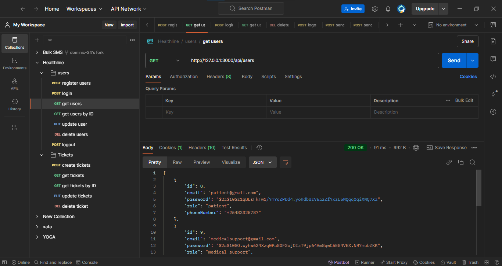

# HealthLine Authentication System

This document outlines the JWT-based user authentication and role-based authorization for the HealthLine backend application. The system includes middleware functions, `authenticate` and `authorize`, for securing user access to endpoints.

## Prerequisites

- **Node.js** and **pnpm**
- **PostgreSQL**
- **TypeScript**
- **Express**
- **TypeORM**

## Setup

### Environment Variables

Create a `.env` file at the root of the project with the following variables:

```plaintext
JWT_SECRET=your_jwt_secret_key
CORS_ORIGIN=http://your-frontend-domain
PORT=5000
DB_PASSWORD=your_db_password
```

## Installation

Install project dependencies
```
pnpm install
```

Run the application
```
pnpm run dev
```

## Authentication Endpoints

### Register User

- **Route: `/api/auth/register`**
- **Method: `POST`**
- **Request Body**
```
{
  "email": "user@example.com",
  "password": "password123",
  "role": "role"
}
```
- **Response: Returns a JWT token in an HTTP-only cookie and a success message**

### Logout User

- **Route**: `/api/auth/logout`
- **Method**: `POST`
- **Response**: Clears the JWT token from cookies and returns a success message.

---

## Sample Usage

### Register Users


### Login Users


### Get Users


### Get User by ID


### Delete User


### Logout User


